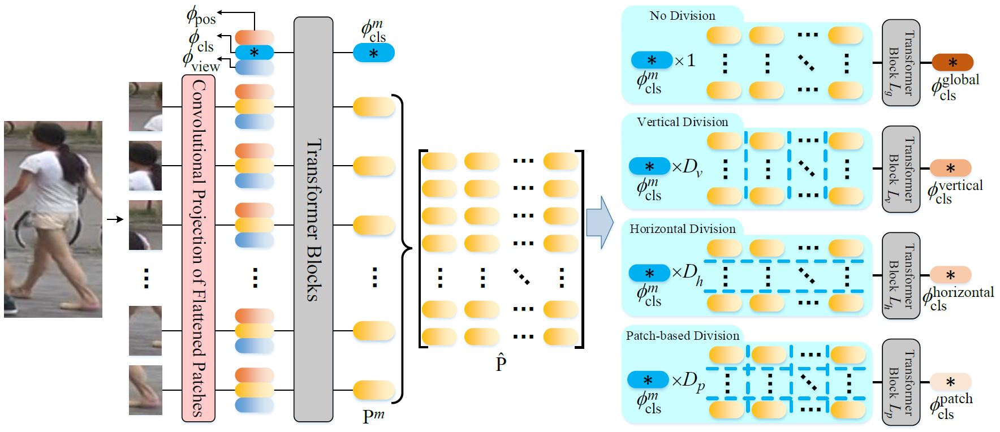

# Multi-direction and Multi-scale Pyramid in Transformer for Video-based Pedestrian Retrieval
  


Implementation of the proposed PiT. For the preprint version, please refer to [[Arxiv]](https://arxiv.org/pdf/2202.06014.pdf).

The complete code is available on https://git.openi.org.cn/zangxh/PiT.git.




## Getting Started
### Requirements
Here is a brief instruction for installing the experimental environment.
```
# install virtual envs
$ conda create -n PiT python=3.6 -y
$ conda activate PiT
# install pytorch 1.8.1 and other dependencies
```

### Download pre-trained model
The pre-trained vit model can be downloaded in this [link](https://github.com/rwightman/pytorch-image-models/releases/download/v0.1-vitjx/jx_vit_base_p16_224-80ecf9dd.pth) and should be put in the `/home/[USER]/.cache/torch/checkpoints/` directory.

## Training and Testing
```
$ python train.py --config_file configs/MARS/vit_transreid_stride.yml MODEL.DEVICE_ID "('0')" 
```


## Results in the Paper
The results of MARS and iLIDS-VID are provided.  

| Model | Rank-1@MARS | Rank-1@iLIDS-VID |
| --- | --- | --- |
| PiT |  [90.22](https://pan.baidu.com/s/1nw5yofEilW0ffG_ZF4eoXQ) (code:wqxv)|  [92.07](https://pan.baidu.com/s/10LosWwUMktTiWvbHEP1Tjw) (code: quci)|

You can download these models and put them in the `../logs/[DATASET]_PiT_1x210_3x70_105x2_6p` directory. Then use the command below to evaluate them.
 ```
$ python test.py --config_file configs/MARS/vit_transreid_stride.yml MODEL.DEVICE_ID "('0')" 
```


## Acknowledgement

This repository is built upon the repository [TranReID](https://github.com/damo-cv/TransReID).

## Citation
If you find this project useful for your research, please kindly cite:

```
@ARTICLE{9714137,
  author={Zang, Xianghao and Li, Ge and Gao, Wei},
  journal={IEEE Transactions on Industrial Informatics}, 
  title={Multi-direction and Multi-scale Pyramid in Transformer for Video-based Pedestrian Retrieval}, 
  year={2022},
  volume={},
  number={},
  pages={1-1},
  doi={10.1109/TII.2022.3151766}
}
```

## License
This repository is released under the GPL-2.0 License as found in the [LICENSE](LICENSE) file.

